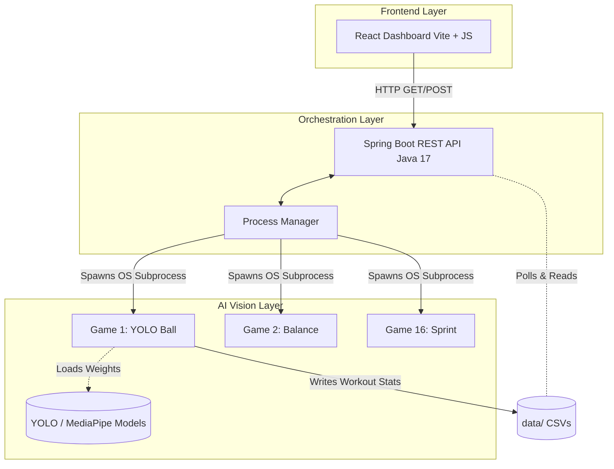
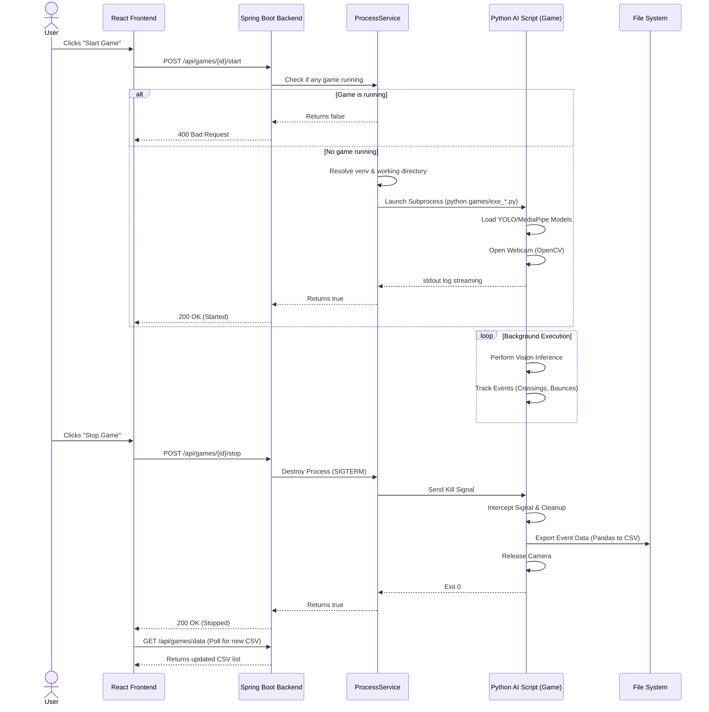
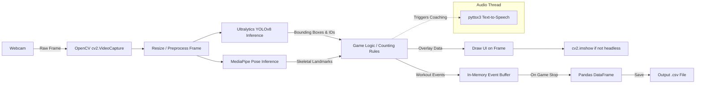

# 🎮 Game Analytics Platform

Welcome to the Game Analytics Platform! This software uses your webcam and advanced AI computer vision to track your movements across 16 different fitness exercises. 

This guide serves both **end-users** looking to play the games and **developers** wanting to understand the underlying architecture.

---

## 🏗️ Architecture & Diagrams

The project is built on a 3-tier local architecture, ensuring low latency for real-time video processing without requiring a persistent cloud connection. Here is a detailed breakdown of the system components, data flow, and interactions.

### 1. Component Architecture
This diagram shows how the three main layers of the application communicate.



### 2. Game Lifecycle Sequence
This sequence diagram illustrates the step-by-step workflow when a user interacts with the dashboard to start and stop a game.



### 3. AI Inference Pipeline (Data Flow)
This data flow diagram shows what happens inside the Python AI script for each video frame during a live game. It highlights the multi-threaded nature of the vision engine.



### 🛠️ Technical Stack
*   **Frontend:** React 18, Vite, Vanilla CSS. Polling-based state synchronization. Served statically by the backend.
*   **Backend:** Java 17, Spring Boot 3.2.5. Acts as a local orchestrator. Manages thread-safe execution of Python scripts via `ProcessBuilder` and exposes a REST API (`http://localhost:8080/api/games`).
*   **AI Engine (Python 3.10+):**
    *   **Ultralytics YOLOv8:** Used for high-speed object detection and tracking (e.g., balls, cones, people).
    *   **MediaPipe:** Used for skeleton and pose estimation to validate exercise form.
    *   **OpenCV (`cv2`):** Handles webcam stream ingestion, frame resizing, and GUI overlays.
    *   **Pandas:** Aggregates telemetry data and flushes it to CSV.
    *   **pyttsx3:** Cross-platform Text-to-Speech (TTS) for real-time audio coaching.

---

## 🔄 How It Works (The Workflow)

1. **Bootstrapping:** Launching `start.bat` or `start.sh` boots the Java Spring Boot server on port `8080`.
2. **UI Interaction:** The user navigates to `localhost:8080` and clicks "Start Game" on a specific exercise (e.g., YOLO Ball Counter).
3. **API Request:** React sends a `POST /api/games/{id}/start` request to the Java backend.
4. **Process Orchestration:** Java checks if any other AI process is running. If clear, it uses a system process to launch the isolated Python script for that specific game.
5. **AI Inference:** The Python script loads the necessary YOLO/MediaPipe models, connects to the webcam, and begins real-time processing in a multi-threaded environment (one thread for vision, one for audio coaching).
6. **Data Export & Cleanup:** When the user clicks "Stop Game", Java sends a termination signal. Python intercepts this, saves the tracking data as a CSV file to the `data/` folder, and safely shuts down the camera.
7. **Review:** The React frontend polls the API, detects the new CSV file, and allows the user to review their workout data.

---

## 🚀 Installation Guide

If this is a brand-new computer, you will need to install a few foundational programs before the game can run. 

### Step 1: Install Prerequisites

> **Important:** If any installer asks to "Add to PATH", make sure you **check that box!**

1. **Install Python (Runs the AI Vision)**
   * **Windows & Mac:** Go to [python.org/downloads](https://www.python.org/downloads/) (Python 3.10+ recommended). 
   * *Crucial Windows Step:* When you open the Python installer, check the box at the very bottom that says **"Add python.exe to PATH"** before clicking Install.
2. **Install Java 17 (Runs the Server)**
   * Go to [Adoptium.net](https://adoptium.net/temurin/releases/?version=17) and download the installer for your OS.
3. **Install Node.js (Runs the Dashboard)**
   * Go to [nodejs.org](https://nodejs.org/) and download the **LTS** version.

### Step 2: Run the Auto-Installer

Now that your computer has the right tools, the project can build itself!

**On Windows:**
1. Open the project folder on your desktop.
2. Click on the address bar at the very top of the folder window, type `cmd`, and press **Enter**.
3. Type the following command and press **Enter**:
   ```cmd
   python install.py
   ```
4. Wait 5-10 minutes while it downloads AI models, builds the website, and configures the server.

**On Mac/Linux:**
1. Open the **Terminal** app.
2. Navigate to the project folder (e.g., `cd ~/Desktop/game-analytics-platform`).
3. Type the following command and press **Enter**:
   ```bash
   python3 install.py
   ```

---

## 🎮 Playing the Game

Once the installer finishes successfully, you will never need to run `install.py` again.

1. **Start the Server:**
   * **Windows:** Double-click the **`start.bat`** file.
   * **Mac/Linux:** Open the terminal in the folder and type `./start.sh`
   *(A black terminal window will pop up. Leave it open in the background!)*
2. **Open the Dashboard:**
   * Open Google Chrome or Safari.
   * Type `http://localhost:8080` into the web address bar.
3. **Play:** Click on any of the 16 exercises to begin your workout.
4. **Stop:** When you are done, go back to the black terminal window running the server and press **Ctrl + C** to shut it down.

---

## 📁 Directory Structure
*   `backend/` - Java Spring Boot application.
*   `configs/` - JSON configuration files for each game (tuning parameters).
*   `data/` - Output directory for generated CSV workout metrics.
*   `frontend/` - React/Vite source code.
*   `games/` - The core Python AI tracking scripts (one per exercise).
*   `models/` - Pre-trained YOLO weights (`.pt` / `.onnx`).
*   `venv/` - Isolated Python environment (generated during install).

---

## 🪟 Windows-Specific Notes

### Camera Access
All games automatically use the **DirectShow** (`CAP_DSHOW`) backend on Windows for optimal webcam performance. No configuration is needed.

### Text-to-Speech (TTS) Threading
Games that use **MediaPipe** (exercises 2, 6, 10, 11, 14, 15, 16) include a COM-safe TTS implementation. On Windows, the `pyttsx3` library uses **SAPI5** (COM-based), which requires explicit per-thread COM initialization when running alongside MediaPipe inference. This is handled automatically — no user action needed.

### Setup Screen Auto-Start
Games with interactive setup screens (exercises 6, 10, 14, 15, 16) will **auto-start after 5 seconds** if no keyboard input is detected. This ensures games launched from the web dashboard don't hang waiting for a key press. You can still press `'s'` manually if you prefer to control the setup timing.

### Python Dependencies
The `requirements.txt` includes `pywin32` (Windows only) for COM thread safety. This is installed automatically by `install.py` and is silently skipped on Linux/Mac.

---

## 🔧 Troubleshooting

| Problem | Cause | Solution |
|---------|-------|----------|
| **Game not responding** (MediaPipe games) | `protobuf` version conflict | Run `pip install protobuf>=4.25.3,<5` in your venv |
| **No camera feed** | Camera in use by another app | Close other apps using the webcam (Zoom, Teams, etc.) |
| **"Java not found"** during install | Java not on PATH | Reinstall Java 17 and check **"Add to PATH"** |
| **"Python not found"** during install | Python not on PATH | Reinstall Python and check **"Add python.exe to PATH"** |
| **Game window doesn't appear** | `game.headless=true` in properties | Edit `backend/src/main/resources/application.properties` and set `game.headless=false` |
| **TTS not speaking** | `pyttsx3` or `pywin32` missing | Run `pip install pyttsx3 pywin32` in your venv |
| **Port 8080 already in use** | Another app using the port | Close the other app or change `server.port` in `application.properties` |

